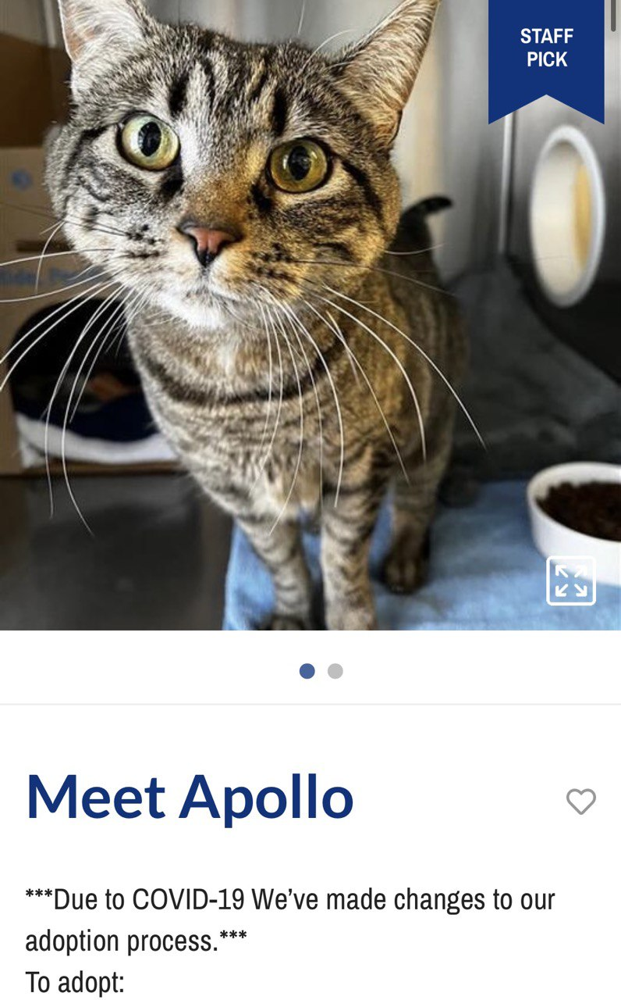

2022年的1月29日，我把女侠领回家了。本篇回忆了决定领养和领养猫猫的全过程。

### 决定养猫
小时候没怎么和猫接触，也没有养猫的经验。几年前我去了一个[Cat Sanctuary](https://www.rapsbc.com/cat-sanctuary/)，这家据说有几百只猫，在开放时段可以和猫猫们尽情玩耍。第一次去的时候我特别开心，但刚离开没多久就发现我好像对猫过敏了。脸发红、想打喷嚏和流鼻涕、眼睛也痒痒的。

*在Sanctuary见到的一些猫猫*

因为有过敏症状，很长一段时间都没有考虑养猫这件事情。期间去做了过敏测试（确实对cat dander-猫咪皮质？过敏），也撸了朋友们的猫，以及进行了更多的云吸猫行为，反正就是越发觉得猫猫可爱 ~~（得不到的总是好）~~。

2021年底，朋友拜托我照顾一只猫，也不知道出于什么原因我对这只猫不太过敏，我就欣然同意了。这只金渐层的性格很好，亲人不凶，除了贪吃没有缺点。

*他和我的手工合照*

刚来家里的时候他三四天都不拉屎。于是我就带他去看兽医，做了一系列检查以后倒是没查出来什么和便秘相关的问题（兽医表示可能只是不太适应），但发现他有肾病。所以作为寄养人的我，要给他吃处方粮，还要带他去做尿检和复查。

*毫无防备地向人类展露肚皮*

和他朝夕相处了一段时间，我感觉到家里有猫是一件多么好的事情。本来我就一个人住，能时不时看到另一只活生生的、软软暖暖的小动物，早上起来还能听见他purr的声音，这种生活太幸福了。至于过敏的问题，期间我一直没对这只猫有过敏反应（除非摸完猫不洗手立刻揉眼睛），所以我猜测以前对猫过敏是因为从小到大都没有机会近距离接触猫的，现在接触多了就建立耐受了。

加上有了带猫去看兽医这样的经验，我觉得我能够照顾好猫，做好养猫的准备了。

*戴着我钩的项圈*

### 开始申请领养猫

虽然很喜欢上面这只寄养在家里的猫猫，但他毕竟是别人的猫，最终还是要离开我的。我决定开始看附近有什么待领养的猫。因为我对品种没有什么执念和要求（只要是猫都很可爱嘛！），而且觉得shelter里已经有很多猫猫啦，就没有想过购买猫。

第一步是先开始搜索周边的shelter，并提交各种申请。很快我收到隔壁城市的SPCA发来的回复：

> Thank you for your interest in Midnight! I have a few things to follow up with you regarding your application!
>
> First, there are a couple applicants ahead of you for Midnight, however, I think you might be a really great match for Apollo!
>
> Apollo is very sweet, confident, and outgoing, and is also quite the chatterbox! She was surrendered primarily due to inappropriate elimination, however while observing her previous vet records it seems like there were many environmental factors that could have explained the elimination issues. Primarily, the introduction of a new dog into the environment, and multiple moves in a short amount of time.
>
> While in our care, Apollo has not shown ANY inappropriate elimination, but she has definitely made it clear that she is not a fan of other cats. Though she does have a history of urinary issues, it does seem that with environmental management and proper access to food and water, she has not had the same issues.
>
> If you'd like to meet with Apollo, let us know - our public hours are in the signature, there is even time this afternoon. If you have any other questions, please let us know!

工作人员告诉我，我申请领养的一只叫Midnight的猫已经有好几个人都提交了申请，但我可能和一只叫Apollo的猫很搭。

这只猫猫性格也很好（很甜、很自信、很外向），被送到shelter的原因是她乱拉尿，但她们觉得是一些环境因素导致的。之前她家里来了一只狗，也在很短的时间内搬了几次家。自从来到了shelter以后她再也没有乱拉过尿。她看起来不喜欢其他猫，所以我家没有其他猫就很合适。

好奇点开了Apollo的资料以后，我就被这只猫萌到啦！

*当当当，她就是女侠！~~这就是一见钟情吗！~~*

于是我迅速和工作人员约了时间，租了车开去隔壁城市看她。

第一次见面就发现她确实是一只很自信的猫，完全不怕生。摸了一会儿她就在我面前展现出肚皮，还边蹭我的手机边purr。当然后来熟了以后才发现，她其实是个窝里横，此处按下不表。

工作人员告诉我，她刚来的时候在多猫房，结果她隔着笼子试图殴打别的猫，就被转移到了单猫房，独占一个房间。为了搞清楚我对她过不过敏，我摘掉口罩和她在房间里独处了一会儿，甚至把脸埋到了她身上（。）都没有什么反应。这个时候我的心已经被她偷走啦！当下就决定要收养她了。

接下来的几天里我买了猫砂盆、猫砂、玩具、猫爬架和猫抓板等等各种她可能会用到的东西，并用粗毛线做了一个小床给她。（[教程在此](https://www.youtube.com/watch?v=h-8YRZFovBk)）

我把猫砂盆、这个床、装了水的餐盒、一个小小的猫抓树放在了卫生间作为她的安全房。

周六的时候，我再次租车到了shelter。签领养文件的时候，工作人员说ta很喜欢Apollo，要不是ta家里已经有几只猫了，可能就领养她了。

把她载回家的路上她一直在哀嚎，我忙于开车也没办法安抚她，只能一路跟她说话。开了一会儿以后她慢慢叫得少一些了，然后我们就到家了。

### 猫猫到家第一天

刚进安全房，她就开始四处探索，看起来不怎么怯生。

因为不太确定她是不是想要自己探索，我在安全房里待了一会儿并放了吃的以后就出去了。没一会儿就听到她在里面喵喵叫，于是我就带上手机充电器，到卫生间里坐下陪她。过了一阵子，她就爬到了我的腿上。🥺 真是好亲人的小猫！

她在我腿上睡了一会儿~~我的屁股也快坐麻了~~以后在小毛线窝上躺下，并开始踩奶了。

看她踩了一会儿奶就躺下睡觉了，感觉她适应得还不错。所以到了晚上我就把卧室门关上，在沙发上铺了一层毯子（这样万一她尿在沙发上好清理），把她从卫生间里放出来了。于是她开始在家巡视一圈，四处看看蹭蹭留下气味，最后在沙发上睡成一坨。

当天晚上，我在沙发上睡了。接近凌晨的时候她跳到了沙发上，挤在我身边睡下了。 

### “女侠”的由来

来家第二天，她就跳到了家里最高的地方，用一种审判世人的眼光看着我。我一边惊叹于她的身手敏捷，一边觉得她的表情非常好笑。

那天晚上，我突然发现她不见了，找遍了全家的每个角落（包括床底下）都找不到她。在我苦苦思考了十分钟脑海中无数种想法呼啸而过以后，终于想起来我前面打开了一下衣柜但是很快就关上门了。再打开衣柜门一看，果然她在里面。当时感觉又好气又好笑，怎么能这么悄无声息又迅速地钻进去呢？仿佛一个武功高强的女侠客，飞檐走壁，身轻如燕，女侠这个名字就这么诞生了。

### 一年的相处
在过去的这一年里，我慢慢学会了怎么给女侠剪指甲、刷牙、喂药等等。刚开始她并不信任我，一旦我想要控制住她，她就会飞快跑走。女侠的肠胃也不太好，时不时就会吐，所以我带她去了很多很多次兽医，做了一系列昂贵的检查以后（还好我买了保险）也并没有发现什么大问题。中间还有几个月她的cat acne（黑下巴）比较严重，除了戴头套、给她用药以外还带她去看了皮肤科。

我的心态也发生了很大的变化。刚开始她一旦有什么不正常我就会非常焦虑，现在因为更加了解她的习性和病史就好多了，也能冷静应对，比如要是她一周之内吐了几次我就会找医生拿药。

更多的时候，我都只是觉得有她真好。能够摸摸她抱抱她、听到她purr的声音、感受到她的重量和体温就很开心。感觉一年前能够顺利领养到她真是非常幸运。

希望可以和她度过很多很多年。

Happy Adoptaversary!


*女侠亲亲！拜拜！*

