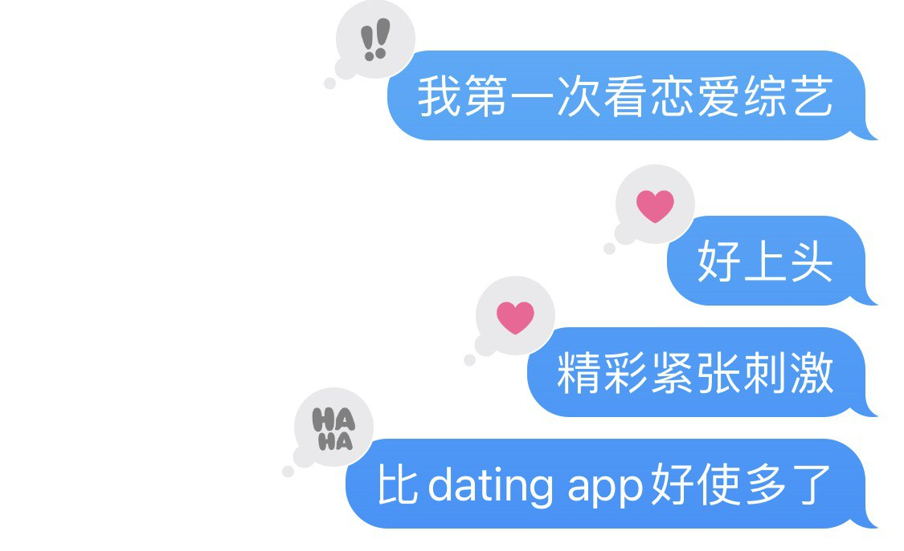

本文正题：吐槽（即：生产赛博乐色）

🎵欢迎配合一首和本文风格完全不符的歌食用🎵


---

在某个月黑风高狂风呼啸大雨滂沱电闪雷鸣（夸张了）的夜晚，我下载了[Hinge](https://hinge.co/)。

有人可能要翻白眼了，多大点事儿，谁没用过啊。我！没！用！过！

在用Hinge之前，我曾经用过一个国产交友软件[Soul](https://www.soulapp.cn/)。花了很长的时间捏了头像并选择了一些感兴趣的话题以后，这个软件告诉我：你是外向星球的人哦！

（活了这么多年才知道，原来我是外向的人……）

截图和朋友吐槽完这个判断以后，我打开了这个软件，开始看看上面的人都在说些什么。不出几分钟，我就在公开时间轴上看到一个帖子：

> 丫头 希望你别为了廉价的新鲜感 丢了陪伴你很久的人…

丫头。

……

在经历了三秒的瞳孔地震以后，我马上把账号和app都删除。从开始刷到删账号，全程不到三分钟。有聊天记录的时间为我作证。

---

回到下载了Hinge的那个晚上，打开app的第一件事就是注册账号和填写资料。

之前我就意识到我很不擅长写自我介绍（通常试图加一些烂梗来糊弄过去），尤其讨厌写dating app上的资料。除了用几句话让别人了解自己很困难以外，我还不知道要如何包装以及展示自己的哪些方面。这件事本身也让我感觉像是主动选择站上橱窗供路人评判。*I hate being perceived.*

很久很久（~~在人类已经毁灭又复生了一遍~~）以后，有个女的终于写完了她的资料。她不再想不开。

但好景不长，刷了几个人以后，她再次想不开了。

## 进入正题

Hinge上一个比较独特的功能是，有很多可供选择的prompt，比如"My simple pleasures"，每个资料要求选择几个prompt进行回答。也有一些prompt可以用图片回答，比如"Comment if you've been here"。在刷的过程中，我发现了~~很多~~一些想要吐槽的资料。

****：在Hinge上刷到的人任何性别的都有，但不幸入选本篇的*恰巧*都是男的。我方强调，任何针对博主的“厌男”指控皆不属实。据调查，该博主的亲生父亲为男性，其他家人同事朋友们也皆有男性存在。希望个别人士能以开放的心态和客观公正的态度对待博主，不要无中生有，否则必将搬起石头砸自己的脚！

### 普通男孩儿

有些回答可能本身没什么问题，可是碰到得多了就显得很重复没有新意。

没碰到十个pineapple on pizza、五个ask me的，还能叫用过Hinge吗？

花式要对方先发消息给自己的，好，有，新，意（缓缓鼓掌）

每当我读到这样的回答，我的内心就会把它翻译成：
要接地气要chill，你们这种动不动就女权不女权、打倒父权制什么的肯定是不行的！嫁不出去！

好用心的回答呢！！

是你吗，You里的Joe Goldberg?

### 一字千金男孩儿
实在懒得回答了，就用表情吧！不由得让人怀疑要是match了也不会聊上呢。

😐🤷‍♀️❓

### Gym Bro 健身男孩儿
怎么的，健身也可以是一个性格特征呢！

哇哦！！（马上点x）

幸运如我，居然刷到了一个典型Finance Bro！早起要边喝咖啡边跟上市场的最新进展！下午要进行一次好棒棒的健身！幸福快乐！（名字还叫Chris，谁懂？）

必须承认这个回答里的"work out"双关还挺特别，但怎么说呢，假如有人第一次约我就是去健身房，我也不会出现的。

### 辣眼睛男孩儿

照片光线不好？表情不好？图片不够清晰？长得不好看？这些都不是问题！！只要你看过辣眼睛的厕所自拍，你就会觉得其他所有人都很顺眼！




这张能清楚看到小便池的照片，加上"As seen on my Mom's fridge"的prompt，给我造成了极大的视觉冲击。请问有谁的妈会挂一张这样的照片在冰箱上啊！！能不能用点心啊！！

### Most Compatible
除此之外，压垮我的最后一根稻草（之一）就是Hinge第一次给我推荐的最合适人选。

看着这个资料，我简直不敢相信这是Hinge算法特别推荐的人，简直感觉非常被冒犯。且撇开我对"not political"这个其实相当political的标签有什么看法，单单对"I'll fall for you"的回答就让人非常疑惑。算法，你难道不知道我是亚洲人吗？算法，真有你的！

---

用了不到几天，我就累了，就连“观察人类”的动力都没有了。只有几个对话在双方match以后被开启了，绝大多数都聊死了。唯一一个持续下去的对话是和一个enby聊钩针和书店，但也只是隔一天才回几句的频率。正逢我要出门旅游，就提前告知对方我会停用Hinge一段时间。等我回家再打开app时，发现对方已经unmatch了我，并从对话列表里消失了。

看着一排灰色的对话列表，我当下就把Hinge给删除了。

特别巧的是，Hinge的知名广告语是：
> The dating app designed to be deleted

最后我也确实删掉了这个软件。

结论就是，用dating app还不如看恋爱综艺。

如果你读到了这里，希望本篇有给你带来一些欢乐。有缘再会。